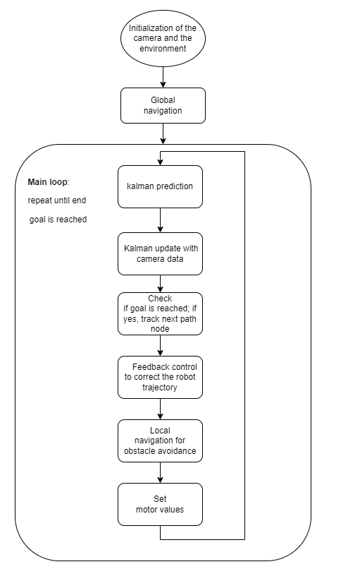
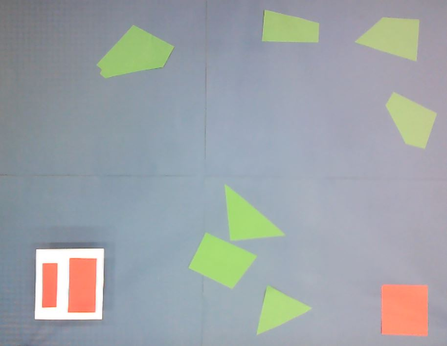
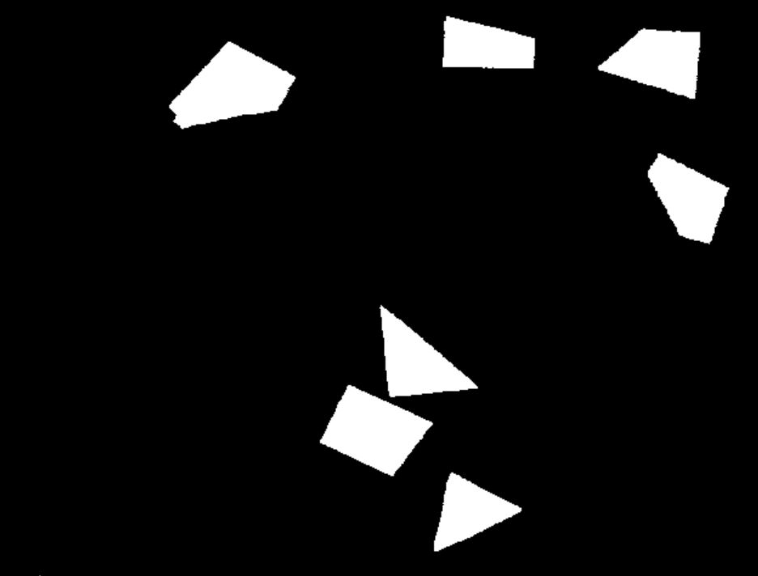
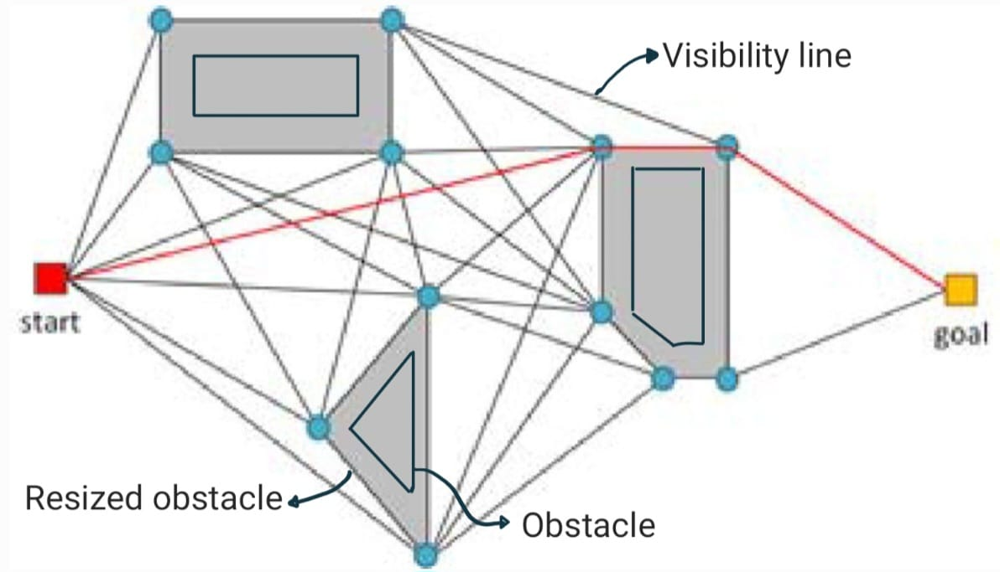

# Mobile Robotics Navigation Project

Autonomous mobile robot navigation project developed for the **Basics of Mobile Robotics** course at EPFL.

## Team Members

* Bastien Marconato (330256)
* Selma Benhassine (300148)
* Mischa Mez (310752)
* Davide Lisi (375197)

---

## Project Overview

This project implements a complete autonomous navigation pipeline for a Thymio robot, combining:

* Computer Vision for environment perception
* Global Path Planning using Visibility Graphs and Dijkstra's Algorithm
* Pose Estimation using an Extended Kalman Filter (EKF)
* Motion Control using a Move-to-Pose controller
* Local Obstacle Avoidance using an Artificial Neural Network (ANN)

The robot autonomously detects obstacles and a goal location, plans a collision-free trajectory, estimates its state in real time, and reacts to unforeseen obstacles while navigating.

---

## System Architecture



The project is divided into the following modules:

### 1. Vision

The vision module uses OpenCV to:

* Detect the robot, obstacles, and goal using color segmentation
* Extract object contours
* Estimate robot position and orientation
* Convert image coordinates (pixels) into real-world coordinates (millimeters)

Main techniques:

* HSV color masking
* Gaussian filtering
* Canny edge detection
* Contour extraction
* Minimum-area bounding rectangles

#### Environment vs. Resulting Obstacles:

          


---

### 2. Global Navigation

The global planner computes a shortest collision-free path between the robot and the goal.

#### Obstacle Processing

Before planning:

1. Obstacles are enlarged to account for robot dimensions.
2. Overlapping obstacles are merged using Shapely.

#### Path Planning

A visibility graph is built using Pyvisgraph.



The shortest path is then computed using Dijkstra's algorithm.

Output:

* Ordered list of waypoints
* Path lengths
* Resized obstacle polygons

---

### 3. Pose Estimation

Robot localization is performed using an Extended Kalman Filter.

State vector:

```text
x = [x, y, θ, vr, vl]
```

Measurements:

* Camera position and orientation
* Wheel encoder velocities

The EKF combines both sensors to obtain a robust estimate of:

* Position
* Orientation
* Wheel velocities

---

### 4. Motion Control

A Move-to-Pose controller drives the robot between waypoints.

Control variables:

```text
ρ     = distance to target
α     = heading error
β     = orientation error
```

Control laws:

```text
v = Kρ ρ
w = Kα α + Kβ β
```

The resulting wheel velocities are sent to the robot motors.

---

### 5. Local Navigation

Local obstacle avoidance handles obstacles not detected by the camera.

#### Physical Sensors

The Thymio horizontal proximity sensors detect nearby objects.

#### Virtual Sensors

Additional virtual sensors are generated from camera information to avoid collisions with globally detected obstacles during local avoidance maneuvers.

#### Artificial Neural Network

A feedforward ANN modifies wheel speeds based on:

* 7 proximity sensors
* 5 virtual sensors
* Current motor commands

Inputs:

```text
7 proximity sensors
5 virtual sensors
2 motor speeds
```

Outputs:

```text
Left motor speed
Right motor speed
```

---

## Repository Structure

```text
.
├── main.py
├── Motion/
│   └── Motion.py
├── Local_Navigation/
│   └── LocalNav.py
├── Computer_vision/
├── Figures/
│   ├── Diagram.png
│   ├── Global_Nav/
│   └── Local_Nav/
└── README.md
```

---

## Dependencies

Install the required Python packages:

```bash
pip install numpy opencv-python matplotlib shapely pyvisgraph tdmclient
```

Additional dependencies may be required depending on your environment.

---

## Running the Project

Connect the Thymio robot and ensure the camera is available.

Run:

```bash
python main.py
```

The program will:

1. Detect obstacles, robot, and goal.
2. Generate a global path.
3. Estimate robot pose with the EKF.
4. Follow the planned trajectory.
5. React to local obstacles in real time.

---

## Results

The implemented navigation stack successfully:

* Detects obstacles and targets using computer vision
* Plans collision-free paths
* Tracks robot pose with sensor fusion
* Navigates toward the goal autonomously
* Avoids unforeseen obstacles during execution

The combination of global planning and local reactive avoidance allows robust operation in dynamic environments.

---

## References

* OpenCV Documentation
* Pyvisgraph Library
* Shapely Geometry Library
* EPFL MICRO-452: Basics of Mobile Robotics
* ETH Zürich – Autonomous Mobile Robots
* Thymio Documentation

---

*EPFL – Basics of Mobile Robotics Project*
